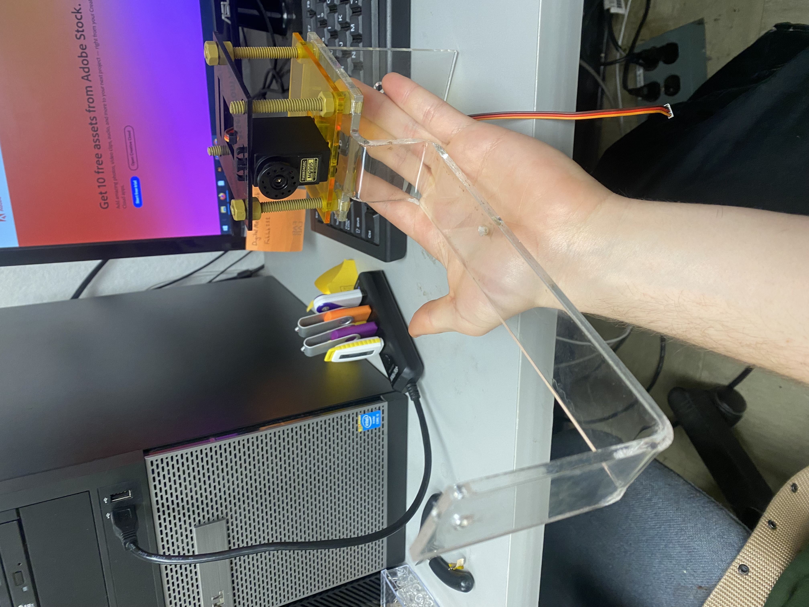

kNAPPULATOR  prototype created.

Have not displayed on wall, but the motor is capable of turning the acrylic and the light shines as expected

Looking to firgure out way to connect the motors far from the arduino and from eachother.

