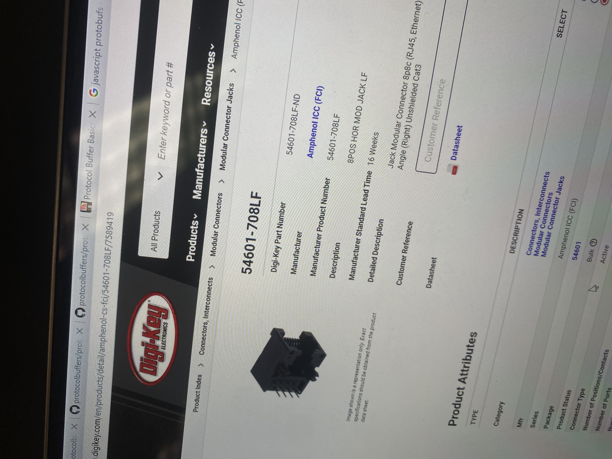

Creating control panels for the motors. 

Switched to Dc motors, Using L293 drivers to have bi directional movement, start stop, and speed control.

Found Rs45 connectors, Will connect motors over long distances with ethernet cables.

